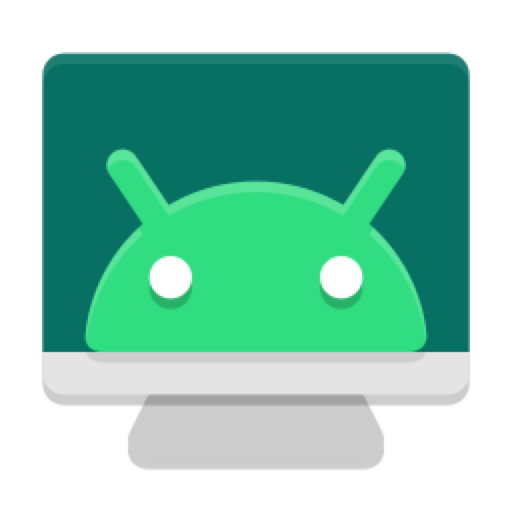
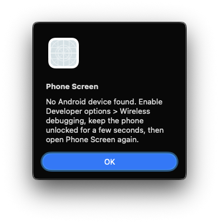
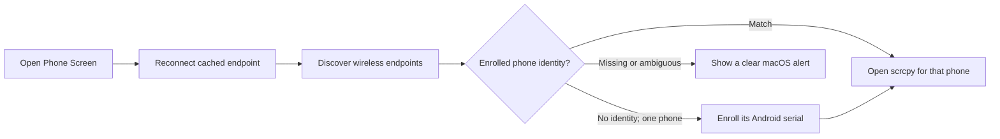

<div align="center">
  
  <h1>Phone Screen for macOS</h1>
  <p>Open a wirelessly paired Android phone in scrcpy with one click.</p>

  [](https://github.com/huzzyz/phone-screen-macos/actions/workflows/test.yml)
  
  [](LICENSE)
</div>

Phone Screen is a small macOS launcher for [scrcpy](https://github.com/Genymobile/scrcpy). It finds an Android device with Wireless debugging enabled, reconnects to its current ADB endpoint, and opens scrcpy—without asking you to look up or type the phone's changing IP address and port.

<p align="center">
  
</p>

## Why it exists

Android may assign a new wireless ADB port whenever Wireless debugging is restarted. ADB discovery can also occasionally miss a device that macOS can still see through DNS-SD. Phone Screen handles that routine automatically and gives you a useful macOS alert when the phone is not ready.

## How it works



Phone Screen tries, in order:

1. Reconnect the last endpoint that worked.
2. Connect endpoints advertised through `adb mdns services`.
3. Fall back to native macOS DNS-SD discovery when needed.
4. Read each wireless device's stable Android serial with `getprop ro.serialno`.
5. Launch only the phone whose serial matches the enrolled identity.

On the first successful launch, exactly one wireless phone must be available. Phone Screen stores that phone's Android serial in `~/.cache/phone-screen/device-serial`. Later changes to the phone's IP address or Wireless debugging port do not affect selection. Unrelated USB ADB devices are never candidates.

It does not bypass Android's pairing or security controls, and it installs nothing on the phone beyond what scrcpy normally uses for a session.

## Requirements

- macOS 11 Big Sur or newer.
- Android 11 or newer for Wireless debugging.
- [Homebrew](https://brew.sh/).
- The Mac and phone on a network where they can reach each other.

Install ADB and scrcpy:

```bash
brew install android-platform-tools scrcpy
```

## Install

### Download the app

1. Download [`Phone-Screen-darwin64.zip`](https://github.com/huzzyz/phone-screen-macos/releases/latest/download/Phone-Screen-darwin64.zip) from the latest release.
2. Unzip it and move **Phone Screen.app** to `/Applications`.
3. Install the required ADB and scrcpy tools if you have not already:

   ```bash
   brew install android-platform-tools scrcpy
   ```

The `darwin64` package works on both Apple silicon and Intel Macs because the launcher itself is architecture-independent. Homebrew installs the correct ADB and scrcpy binaries for your Mac.

### Install from source

Clone the project and install the app:

```bash
git clone https://github.com/huzzyz/phone-screen-macos.git
cd phone-screen-macos
make install
```

`make install` builds and copies **Phone Screen.app** to `/Applications`. If an older copy exists, the installer moves it to a timestamped backup on your Desktop first.

The app is currently ad-hoc signed rather than notarized. If macOS blocks the first launch, Control-click **Phone Screen** in Finder, choose **Open**, then confirm once.

## First-time phone setup

Pair the Mac once before using the one-click launcher:

1. On Android, open **Settings → Developer options → Wireless debugging**.
2. Tap **Pair device with pairing code**.
3. On the Mac, run:

   ```bash
   adb pair PHONE_IP:PAIRING_PORT
   ```

4. Enter the six-digit pairing code shown on the phone.

Pairing normally persists. You should not need to repeat it when Android changes the connection port.

## Everyday use

1. Enable **Wireless debugging** on the phone.
2. Keep the phone unlocked for a few seconds.
3. Open **Phone Screen** from Applications, Spotlight, or the Dock.

Phone Screen discovers the current endpoint and opens scrcpy. When Wireless debugging is off or the phone cannot be reached, it tells you what to check instead of silently doing nothing.

If another Android-based device is attached over USB, Phone Screen ignores it. If several distinct wireless phones are visible before enrollment, Phone Screen refuses to guess and explains how to make the choice unambiguous.

## Troubleshooting

### “No Android device found”

- Confirm Wireless debugging is enabled and the phone is unlocked.
- Confirm the phone and Mac can reach one another on the local network. Guest Wi-Fi and client isolation commonly block discovery.
- Open Wireless debugging and check whether the Mac still appears under **Paired devices**.
- If pairing was removed, repeat the one-time pairing steps above.

### ADB or scrcpy is missing

Reinstall the dependencies and reopen Phone Screen:

```bash
brew install android-platform-tools scrcpy
```

### More than one phone is connected

Once a phone is enrolled, Phone Screen selects it by its stable Android serial even when other wireless phones are visible. On first use, leave Wireless debugging enabled only on the phone you want to enroll.

### Change the enrolled phone

Quit Phone Screen, then remove the saved identity:

```bash
rm ~/.cache/phone-screen/device-serial
```

Leave Wireless debugging enabled only on the replacement phone and open Phone Screen again. Its identity will be enrolled after the connection is verified.

### The phone is found but no window opens

Phone Screen displays the final scrcpy error and saves the complete output to `~/.cache/phone-screen/last-run.log` so startup failures are no longer silent.

If macOS cannot start scrcpy's CoreAudio output, Phone Screen automatically retries in video-only mode. Device control and screen mirroring remain available; only phone audio is omitted for that session. Other scrcpy failures are still reported normally.

## Build and test

```bash
make test
make build
make package
```

- `make build` creates `dist/Phone Screen.app`.
- `make package` also creates `Phone-Screen-darwin64.zip` and its SHA-256 checksum.
- `make install` builds and installs the app in `/Applications`.

Tests use fixture commands and do not require a connected Android device.

## Uninstall

From the cloned repository:

```bash
bash scripts/uninstall.sh
```

You may also delete `/Applications/Phone Screen.app` manually. Connection state is stored in `~/.cache/phone-screen/`: `last-endpoint` caches the changing network endpoint, while `device-serial` identifies the enrolled phone. Remove that directory only if you want to reset both.

## Security

Wireless ADB grants control of your phone. Use it only on networks you trust, keep pairing codes private, and disable Wireless debugging when you are finished. Phone Screen has no analytics, accounts, or cloud service.

## Credits

Phone Screen is a convenience launcher, not a fork or replacement for scrcpy. Screen mirroring and device control are provided by [scrcpy](https://github.com/Genymobile/scrcpy), maintained by Genymobile and Romain Vimont.

## License

Phone Screen is available under the [MIT License](LICENSE). scrcpy is a separate project distributed under its own license.
